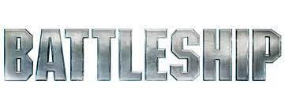

<!-- PROJECT LOGO -->
 

  

<h3 align="center">Battleship Game</h3>

  

    A Battleship game with extended features created using Qt and C++.
     
  

<!-- TABLE OF CONTENTS -->

  
Table of Contents

  <ol>
    <li>
      <a href="#about-the-project">About The Project</a>
      <ul>
        <li><a href="#built-with">Built With</a></li>
      </ul>
    </li>
    <a href="#about-the-project">About The Project</a>
    <li><a href="#contact">Contact</a></li>
  </ol>

<!-- ABOUT THE PROJECT -->
## About The Project

This project is a replica of the classic board game, Battleship. The game was was created in Qt with C++, so you must have Qt to run the game files. In addition to the classic game rules, this version contains two new attacks which can each be used once per game per player: Scattershot (attack 5 squares in the shape of a "+" sign) and Napalm Strike (attack a whole row of the opponent's game board). A grey game board square indicates an unattacked square, while blue indicates a miss and orange indicates a hit.

(<a href="#top">back to top</a>)

 
 
To view some screenshots of gameplay, please refer to this link: <a href="https://github.com/jrogers2400/Battleship-Game/tree/main/Battleship%20Screenshots">Project Screenshots</a>

### Built With

* [Qt](https://www.qt.io/)
* [C++](https://cplusplus.com/)

(<a href="#top">back to top</a>)

<!-- CONTACT -->
## Contact

Jack Rogers  - jrogers2400@gmail.com

Project Link: [https://github.com/jrogers2400/Battleship-Game.git](https://github.com/jrogers2400/Battleship-Game.git)

(<a href="#top">back to top</a>)

(<a href="#top">back to top</a>)

